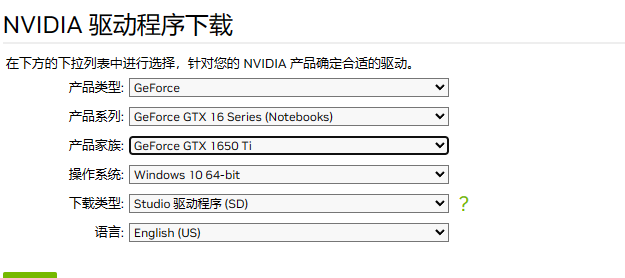
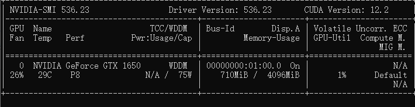
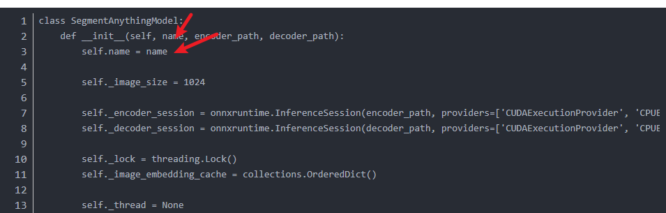
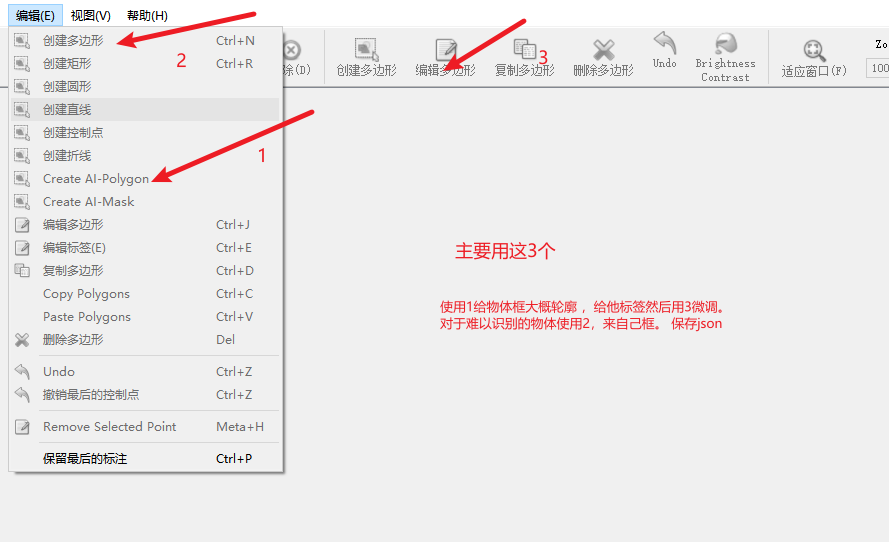

# glass_yolov8_andorid

玻璃破碎yolov8-seg-Ncnn实时监测及图像检测
①②③④⑤⑥⑦⑧⑨⑩

## &#x1F554;1. 训练自己的数据集

### ①  安装cuda,cudnn,torch, torchvison

- (1).首先要在设备管理器中查看你的显卡型号,然后去[NVIDIA 驱动](https://www.nvidia.cn/Download/index.aspx?lang=cn)下载驱动。

- （2）完成之后，在cmd中输入执行：``nvidia-smi``
   
   注：**图中的 CUDA Version是当前Driver版本能支持的最高的CUDA版本。**

- (3) 安装[cuda](https://developer.nvidia.com/cuda-toolkit-archive)，cudnn。(我的CUDA用的是11.8版本)
 请参考[CUDA安装教程（超详细）](https://blog.csdn.net/m0_45447650/article/details/123704930?ops_request_misc=%257B%2522request%255Fid%2522%253A%2522171023307216800197048699%2522%252C%2522scm%2522%253A%252220140713.130102334..%2522%257D&request_id=171023307216800197048699&biz_id=0&utm_medium=distribute.pc_search_result.none-task-blog-2~all~top_positive~default-1-123704930-null-null.142^v99^pc_search_result_base1&utm_term=%E5%AE%89%E8%A3%85cuda&spm=1018.2226.3001.4187)该教程安装。
(4) 离线安装torch, torchvision
  - [清华源](https://mirrors.tuna.tsinghua.edu.cn/anaconda/cloud/pytorch/win-64/)下找对应版本。
  - 参考[此教程](https://blog.csdn.net/baidu_41774120/article/details/128588759?ops_request_misc=%257B%2522request%255Fid%2522%253A%2522171023369016800186583425%2522%252C%2522scm%2522%253A%252220140713.130102334..%2522%257D&request_id=171023369016800186583425&biz_id=0&utm_medium=distribute.pc_search_result.none-task-blog-2~all~sobaiduend~default-2-128588759-null-null.142^v99^pc_search_result_base1&utm_term=%E5%AE%89%E8%A3%85torch%20torchvision&spm=1018.2226.3001.4187)。
  **注意:最好torch选择1.10以上。**

## ② 安装labelme+sam进行半自动化标注

- (1)``conda create --name=labelme python=3.8``
``conda activate labelme``
``pip install labelme``
- (2) 下载[evethings](https://www.voidtools.com/zh-cn/)找到labelme/ai所在目录。
- (3)[参考Labelme加载AI（Segment-Anything）模型进行图像标注](https://blog.csdn.net/qq_50993557/article/details/134616280)中从二(2)开始。(文件[modelfile](https://pan.baidu.com/s/1QiuDB6efCjNYZ5QwxXPdig?pwd=1bn7))
- (4) 接着``在labelme\ai\segment_anything_model.py``文件中修改。
    

## ③制作自己数据集

  在命令行中输入labelme(如果是conda请切换环境)

- 打开目录(自己的图片文件夹)。
- 编辑(create-AI-Polygon或者编辑多边形)。
- 制作数据集。

## ④ 基于自己的数据训练yolov8

安装ultralytics，目前YOLOv8核心代码都封装在这个依赖包里面，可通过以下命令安装
``pip install ultralytics``
