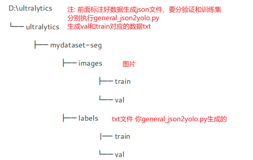
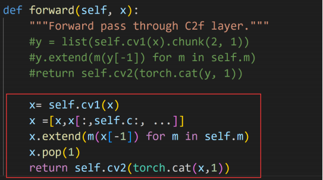
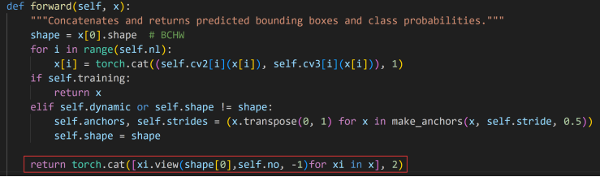
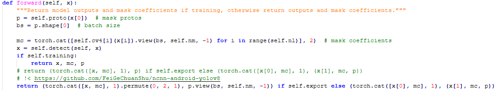
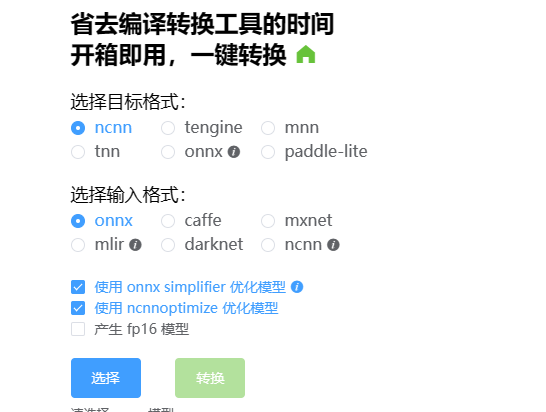
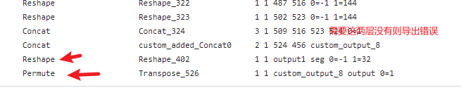
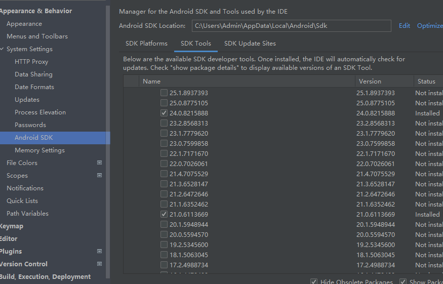
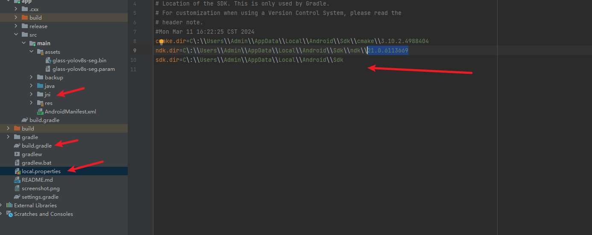
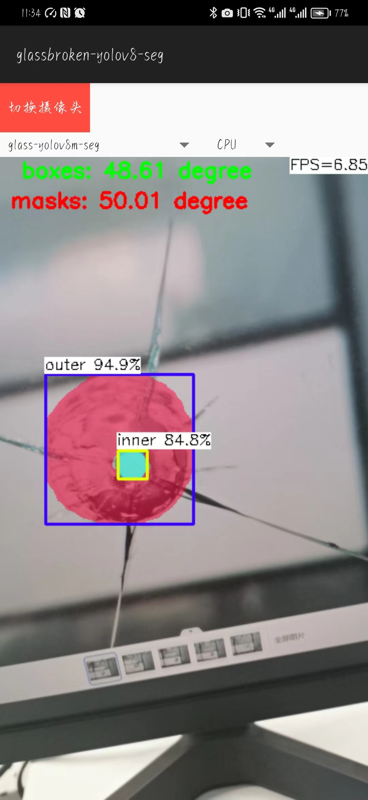

# GlassYOLOv8 Android: 玻璃破碎实时监测与图像检测

本项目使用YOLOv8-seg-Ncnn实现了对玻璃破碎的实时监测及图像检测，支持在Android设备上运行。以下是项目的详细指南。

## :sparkles: 特性
- 现实世界中玻璃破碎的实时检测。
- 支持自定义数据集训练。
- Android端部署，便于移动应用。
- 包含详细的安装和配置指南。
 
### 1. 训练自己的数据集
 
### ①  安装cuda,cudnn,torch, torchvison

- (1).首先要在设备管理器中查看你的显卡型号,然后去[NVIDIA 驱动](https://www.nvidia.cn/Download/index.aspx?lang=cn)下载驱动。

- （2）完成之后，在cmd中输入执行：``nvidia-smi``
   
   注：**图中的 CUDA Version是当前Driver版本能支持的最高的CUDA版本。**

- (3) 安装[cuda](https://developer.nvidia.com/cuda-toolkit-archive)，cudnn。(我的CUDA用的是11.8版本)
 请参考[CUDA安装教程（超详细）](https://blog.csdn.net/m0_45447650/article/details/123704930?ops_request_misc=%257B%2522request%255Fid%2522%253A%2522171023307216800197048699%2522%252C%2522scm%2522%253A%252220140713.130102334..%2522%257D&request_id=171023307216800197048699&biz_id=0&utm_medium=distribute.pc_search_result.none-task-blog-2~all~top_positive~default-1-123704930-null-null.142^v99^pc_search_result_base1&utm_term=%E5%AE%89%E8%A3%85cuda&spm=1018.2226.3001.4187)该教程安装。
(4) 离线安装torch, torchvision
  - [清华源](https://mirrors.tuna.tsinghua.edu.cn/anaconda/cloud/pytorch/win-64/)下找对应版本。
  - 参考[此教程](https://blog.csdn.net/baidu_41774120/article/details/128588759?ops_request_misc=%257B%2522request%255Fid%2522%253A%2522171023369016800186583425%2522%252C%2522scm%2522%253A%252220140713.130102334..%2522%257D&request_id=171023369016800186583425&biz_id=0&utm_medium=distribute.pc_search_result.none-task-blog-2~all~sobaiduend~default-2-128588759-null-null.142^v99^pc_search_result_base1&utm_term=%E5%AE%89%E8%A3%85torch%20torchvision&spm=1018.2226.3001.4187)。
  **注意:最好torch选择1.10以上。**

### ② 安装labelme+sam进行半自动化标注

- (1)``conda create --name=labelme python=3.8``
``conda activate labelme``
``pip install labelme``
- (2) 下载[evethings](https://www.voidtools.com/zh-cn/)找到labelme/ai所在目录。
- (3)[参考Labelme加载AI（Segment-Anything）模型进行图像标注](https://blog.csdn.net/qq_50993557/article/details/134616280)中从二(2)开始。(文件[modelfile](https://pan.baidu.com/s/1QiuDB6efCjNYZ5QwxXPdig?pwd=1bn7))
- (4) 接着``在labelme\ai\segment_anything_model.py``文件中修改。
    

### ③制作自己数据集以及对应yolov8训练格式

  在命令行中输入labelme(如果是conda请切换环境)

- 创建mydatasets,数据集图像文件放置在mydatasets目录下

- 打开目录(自己的图片文件夹mydatasets)。
- 编辑(create-AI-Polygon或者编辑多边形)。
- 制作数据集。 标注后生成json文件 分验证和测试集（在mydatasets中挑选一部分的图片和对应的json放到glass_val文件夹(自己创建)下）

**注: 玻璃破碎数据集有2个类别："inner","outer"**

- 图像标注格式转换 json->coco->yolo
  - 把labelme标注的json数据格式转换成COCO数据格式的参考[该项目](https://github.com/Tony607/labelme2coco/tree/master)
  - COCO格式标注数据转换成YOLO格式 参考[该项目][def]中general_json2yolo.py 文件
     其中修改代码

    ```python
      if source == 'COCO':
      convert_coco_json('../mydatasets/annotations', #创建annotations把生成的json文件放进去 directory with *.json 
      use_segments=True,cls91to80=False)
    ```

    在def convert_coco_json(json_dir='../coco/annotations/', use_segments=False, cls91to80=False):   中修改一句

    ```python
    #cls = coco80[ann['category_id'] - 1] if cls91to80 else ann['category_id'] - 1 
    cls = coco80[ann['category_id'] - 1] if cls91to80 else ann['category_id'] # 
    ```

    执行
    **python general_json2yolo.py**  生成labels 和images文件夹，images中没有数据
    把转成的YOLO数据格式（labels中的txt文件）的数据的目录结构准备成YOLO目录结构格式。
  - 创建对应yolo的工作目录
    

### ④ 基于自己的数据训练yolov8

- 安装ultralytics，目前YOLOv8核心代码都封装在这个依赖包里面，可通过以下命令安装
``pip install ultralytics``
- 下载预训练权重文件
  下载yolov8s-seg.pt权重文件，并放置在创建的weights文件夹下
下载链接：<https://docs.ultralytics.com/tasks/segment/>

> 例如： D:\ultralytics\ultralytics\weights

- 安装测试
执行

  ```python
  yolo segment predict model=D:/ultralytics/ultralytics/weights/
  yolov8-seg.pt source=D:/ultralytics/ultralytics/assets/bus.jpg
  ```

  摄像头

  ```python
  yolo segment predict model=D:/ultralytics/ultralytics/weights/
  
  yolov8s-seg.pt source=0 show
  ```

- 把制作好的mydatasets-seg数据集放到ultralytics\ultralytics\datasets下

- 修改配置文件
  - 修改文件datasets/coco8-seg.yaml

      ```bash
      path: D:/ultralytics/ultralytics/datasets/mydatasets-seg # dataset root dir
    train: images/train # train images (relative to 'path')  
    val: images/val # val images (relative to 'path')  
    test: # test images (optional)
    # Classes
    names:
    0: inner
    1: outer
    ```

  - 修改文件ultralytics/models/v8/seg/yolov8-seg.yaml

    ```bash
    nc: 80 # number of classes 改为自己的类别 我的是nc=2
    ```

- 基于yolov8训练数据集

```python
yolo detect train data=D:\ultralytics\ultralytics\datasets\coco8-seg.yaml 
model=D:\ultralytics\ultralytics\weights\yolov8s-seg.pt epochs=100   imgsz=640 batch=16 workers=4
```

- 训练结果的查看
 查看D:\ultralytics\runs\segment\train\weights目录下的文件
- 测试训练出的网络模型

  - 测试图片

  ```python

  yolo segment predict 
  model=D:\ultralytics\runs\segment\train\weights\best.pt 
  data=D:\ultralytics\ultralytics\datasets\coco8-seg.yaml 
  source=D:\ultralytics\ultralytics\mydatasets-seg\images\val\img_val001.jpg

  ```

  - 批量测试图片

  ```python
  yolo segment predict 
  model=D:\ultralytics\runs\segment\train\weights\best.pt 
  data=D:\ultralytics\ultralytics\datasets\coco8-seg.yaml 
  source=D:\ultralytics\ultralytics\mydatasets-seg\images\val
  ```

## 2.导出修改网络结构导出onnx 

- 修改文件1：
  D:\ultralytics\ultralytics\nn\modules\block.py中
  class C2f(nn.Module)改动如下
  
- 修改文件2：
  D:\ultralytics\ultralytics\nn\modules\head.py中
class Detect(nn.Module)改动如下
 
- 修改文件3: 
  D:\ultralytics\ultralytics\nn\modules\head.py
  

**具体请参考改[项目](https://github.com/Digital2Slave/ncnn-android-yolov8-seg/wiki/Convert-yolov8%E2%80%90seg-to-ncnn-model-step-by-step)中1·1-1.4 导出onnx**

### ① 自动onnx转换成NCNN文件

使用该[网站](https://convertmodel.com/)一键生成ncnn：
 


 
 
### ② 手工对于 yolov8l-x无法使用①生成

请参考[该教程](https://blog.csdn.net/qq_40231159/article/details/111808792)

### 判断生成的ncnn是否适合编译

在 %s.param中查看是否有这两层 

##3. yolov8语义分割部署安卓手机


### ①安装Android Studio

官网：https://developer.android.google.cn/studio/
  
> 安装时会提示安装SDK
> 同意licenses
>注意：Android SDK安装路径中不要有空格
>注意配置：
>File->Settings->Appearance & Behavior ->System Settings->Android
>SDK
>SDK Platforms选中面向手机的Android版本
>SDK Tools选中NDK, CMake
>注意：cmake的版本选择不要太高


### ②android studio编译问题
您可能需要[这个](https://blog.csdn.net/qq_42257666/article/details/130725656?spm=1001.2014.3001.5502)


参照[该教程](https://blog.csdn.net/liujiahao123987/article/details/128880640?ops_request_misc=%257B%2522request%255Fid%2522%253A%2522171029765216800188545662%2522%252C%2522scm%2522%253A%252220140713.130102334.pc%255Fblog.%2522%257D&request_id=171029765216800188545662&biz_id=0&utm_medium=distribute.pc_search_result.none-task-blog-2~blog~first_rank_ecpm_v1~rank_v31_ecpm-1-128880640-null-null.nonecase&utm_term=ncnn&spm=1018.2226.3001.4450)放置所需文件,参考我的目录修改。以及该[教程](https://github.com/FeiGeChuanShu/ncnn-android-yolov8/issues/8)可能会给您一点灵感。
 


 
我的文件：https://pan.baidu.com/s/1VGfMw8Bjmn0Utlj2nJWLMQ?pwd=tpqa 
 

##  :camera_flash:最终实时检测效果以及我们修改后的效果是（左上角有角度）


apk: ：https://pan.baidu.com/s/16LtEqdpjhlTXz_jzZE72dQ?pwd=o4dz 

 
 ## [图片检测](链接：https://pan.baidu.com/s/1w5dBCZI4nc0O56xqDjfw-Q?pwd=boh4 )
 注意:图像检测时候jni yoloncnn.cpp 需要改图像尺寸

 
 
 

## :link: 相关链接
- [项目代码](https://github.com/your-github-repo)
- [训练模型下载](https://pan.baidu.com/s/16LtEqdpjhlTXz_jzZE72dQ?pwd=o4dz)
- [Android APK下载](https://pan.baidu.com/s/16LtEqdpjhlTXz_jzZE72dQ?pwd=o4dz)
- [图片检测示例](https://pan.baidu.com/s/1w5dBCZI4nc0O56xqDjfw-Q?pwd=boh4)

## :question: 帮助
如遇到问题，请参考[FAQ](链接)或提交[Issue](https://github.com/Luhuanz/glass_yolov8_andorid/issues)。
 
